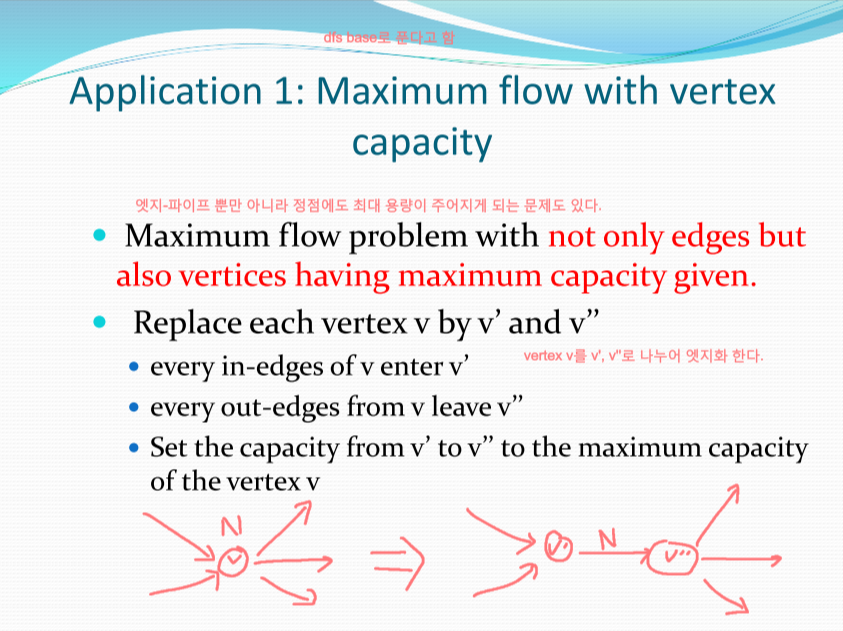

2022-05-31 (1)
---

####첫 TIL
- 오늘부터 TIL이란것을 쓰기로 결심했다.
- 그날 배운것을 그날 정리함으로서 정보의 유실을 줄이고 깃 커밋률을 높일것이다.

####Maximum Flow(Edmonds-Karp) 알고리즘을 응용하는 방법 4가지
> 1. Vertex에도 Capacity가 존재하는 문제를 해결하는 방법
> 
> > 1. 정점 v를 v'와 v''로 교체한다.
> > 2. v의 in-edge를 v'로 들어가도록 연결한다.
> > 3. v의 out-edge를 v''로 나가도록 연결한다.
> > 4. v'에서 v''로 가는 edge의 capacity를 vertex v의 capacity로 설정한다.
> > 5. 이후는 Edmonds-Karp로 풀면 됨

####summary

####Reference